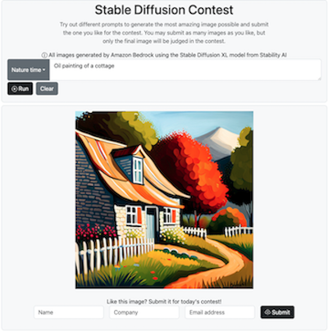

# Generating Images with Amazon Bedrock and Stable Diffusion
Amazon Bedrock is a fully managed service that offers a choice of high-performing foundation models (FMs) from leading AI companies like AI21 Labs, Anthropic, Cohere, Meta, Stability AI, and Amazon with a single API, along with a broad set of capabilities you need to build generative AI application. Stable Diffusion XL is the most advanced text-to-image model from Stability AI.

The application in this repo demonstrates using [Amazon Bedrock with the Stable Diffusion XL foundation model](https://aws.amazon.com/bedrock/stable-diffusion/) to generate realistic and artistic images from text prompts. The application includes:
- A frontend built with HTML, CSS and JavaScript that allows users to input text prompts and view generated images.
- A backend webserver with Node.js, AWS SDK for JavaScript
- Generating images using the Bedrock API
- Uploading of generated images to an S3 bucket via the UI.
- Storage of image metadata in DynamoDB.

The application can be deployed on an EC2 instance to provide an image generation service. 
Some potential use cases:
- Run contests where participants submit computer-generated images for themes. Images are uploaded to S3 for evaluation.
- Allow users to quickly create images from text prompts as part of a larger application.
- Education/demonstration of how foundation models can generate images.



## Prerequisites
1. Set up Node.js using instructions [here](https://docs.aws.amazon.com/sdk-for-javascript/v2/developer-guide/setting-up-node-on-ec2-instance.html)
2. Install NPM: `npm install npm@latest -g`. Make sure you have atleast Node version 18 running. To change versions, use `nvm use $version`
3. Launch an Amazon EC2 instance through the AWS Console
4. Clone this repository onto the EC2 Instance
5. To allow TCP access to your EC2 instance:  
 a. Add inbound rules to your VPC security group using instructions [here](https://docs.aws.amazon.com/AmazonRDS/latest/UserGuide/CHAP_Tutorials.WebServerDB.CreateVPC.html#:~:text=Create%20VPC.-,Create%20a%20VPC%20security%20group%20for%20a%20public%20web%20server,-Next%2C%20you%20create)  
 b. Set the following values for your new inbound rule to allow TCP access to your web server:  
    Type: Custom TCP  
    Source: 0.0.0.0/0  
    Port: 8002
6. Optional: To keep the application alive forever, Install PM2: `npm install pm2 -g`
7. Ensure you have access to [Amazon Bedrock](https://aws.amazon.com/bedrock/) and to the model stability.stable-diffusion-xl from Amazon Bedrock.
8. Configure HTTPS for the webserver, refer to [Create and sign X509 certificate](https://docs.aws.amazon.com/elasticbeanstalk/latest/dg/configuring-https-ssl.html) and then set the full path of the generated private key, public certificate and optionally ca bundle(intermediate certificates if any) as environment variables:
`export SSL_PRIVATE_KEY=<<fullpathtoprivatekey>>`, `export SSL_ROOT_CERT=<<fullpathtopubliccert>>`, `export SSL_CA_BUNDLE=<<fullpathtocabundle>>`


### Enable AWS IAM permissions

The AWS identity you assume from your environment(could be a role or IAM User) must have sufficient [AWS IAM permissions](https://docs.aws.amazon.com/IAM/latest/UserGuide/access_policies.html) to call the Amazon Bedrock service, S3, DynamoDB.

To grant Bedrock access to your identity, you can:

- Open the [AWS IAM Console](https://us-east-1.console.aws.amazon.com/iam/home?#)
- Find your [Role](https://us-east-1.console.aws.amazon.com/iamv2/home?#/roles) or else [User](https://us-east-1.console.aws.amazon.com/iamv2/home?#/users)
- Select *Add Permissions > Create Inline Policy* to attach new inline permissions, open the *JSON* editor and paste in the below example policy for Amazon Bedrock:

```
{
    "Version": "2012-10-17",
    "Statement": [
        {
            "Sid": "BedrockFullAccess",
            "Effect": "Allow",
            "Action": ["bedrock:*"],
            "Resource": "*"
        }
    ]
}
```
- Select Add Permissions -> Attach Policies -> AmazonS3FullAccess, AmazonDynamoDBFullAccess (AWS managed policy)

## Running the application
1. Install NPM Packages: `npm i`
2. Create a S3 bucket to save the submissions for the contest and set the S3 bucket name in the environment variables: `export S3Bucket=sampleBucketName`
3. Start the node server on the EC2 from the project root directory by running `node js/server/prompt_server.js`, or if you are using PM2, run `pm2 start js/server/prompt_server.js`
4. Use a web browser to connect to your web server using the public DNS name or IP address of the server. Ensure that the URL in the address bar begins with https://. For example, https://ec2-xx-xx-xx-xx.us-west-2.compute.amazonaws.com:8002/. The server is configured to listen on port 8002. To override any other port `export PORT=xxxx`
5. Input any prompt and click the 'Run' button to generate images powered by Stable Diffusions models powered by Amazon Bedrock.
6. Optional: If you plan to use the app for running a contest, provide your name and other details to submit the images. These images will be saved to the S3 bucket created in Step 2. The submission details (name, email, prompt and S3 file location) will be saved to a DynamoDB table.

## Authors and acknowledgment
This was created by Sindhu Jambunathan and Justin Muller of Amazon Web Services.

## Contributing
We welcome community contributions! Please see [CONTRIBUTING.md](CONTRIBUTING.md) for guidelines.

## Security
See [CONTRIBUTING](CONTRIBUTING.md#security-issue-notifications) for more information.

## License
This library is licensed under the MIT-0 License. See the LICENSE file.
